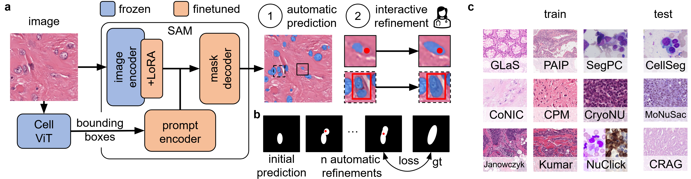
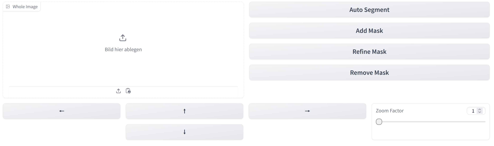

# CellPilot
This repository contains the code of CellPilot, a deep learning-based method for the automatic and interactive segmentation of cells and glands in histological images. CellPilot uses [SAM](https://arxiv.org/abs/2304.02643) and [CellViT](https://arxiv.org/abs/2306.15350) and is fine-tuned on large-scale segmentation datasets of histological images.


## Key Features
- **Automatic Segmentation**: CellPilot allows users to automatically segment cells in histological images.
- **Interactive Segmentation**: CellPilot allows users to interactively segment cells and glands in histological images.

## Setup
1. Clone the repository with: `git clone https://github.com/philippendres/CellPilot.git`
2. Create a new conda environment with the provided environment.yml file:
    ```
    conda env create -f environment.yml
    conda activate histo3.10
    ```
3. Install the resources:
    ```
    cd resources
    cd CellViT
    git submodule init
    git submodule update
    pip install -e .
    cd ..
    cd SimpleClick
    git submodule init
    git submodule update
    pip install -e .
    cd ..
    cd ..
    pip install git+https://github.com/facebookresearch/segment-anything.git
    pip install schedulefree
    pip install slideio
    pip install scikit-image
    pip install albumentations
    pip install monai
    pip install wandb
    pip install einops
    pip install gradio-image-prompter
    pip install gradio

    ```
4. Install our package: 
    ```
    pip install -e .
    ```
5.  - For inference and training: Download the weights of the CellPilot model and the CellViT model: [CellPilot](https://1drv.ms/u/c/696e40c0eaa91ac3/EfwN6MP4IqpHityPWHnHkkgBh5MyZEdYGVf9soXDs0gKOg?e=M8DVNQ), [CellViT](https://drive.google.com/uc?export=download&id=1tVYAapUo1Xt8QgCN22Ne1urbbCZkah8q), [SAM](https://dl.fbaipublicfiles.com/segment_anything/sam_vit_b_01ec64.pth)
    - For model comparisons: Download the weights of the SimpleClick and the MedSAM model: [SimpleClick](https://drive.google.com/file/d/1dLAEFXhnk_Nebq3Net11sf6MjRCBEe0O/view?usp=drive_link), [MedSAM](https://drive.google.com/file/d/1UAmWL88roYR7wKlnApw5Bcuzf2iQgk6_/view?usp=drive_link)

## Usage
### App
Run the gradio webapplication with the following command:
```
python app.py --model_dir <model_dir> --model_name <model_name> --cellvit_model <cellvit_model>
```
The app has the following arguments:
- **model_dir**: The directory where the CellPilot and the CellViT model are stored.
- **model_name**: The name of the CellPilot model. (append .ckpt)
- **cellvit_model**: The name of the CellViT model.

The command above will generate a link to a webapplication where you can upload your own images and segment them with SAMHI.
The app will look like this:

The app has the following features:
- **Upload Image**: Upload your own image to segment in the upper left corner.
- **Auto Segment**: Automatically segment the uploaded image with CellPilot.
- **Add Mask**: Interactively add a mask with CellPilot by drawing points and bounding boxes on the image.
- **Refine Mask**: Refine an existing mask by drawing points and bounding boxes on the image.
- **Remove Mask**: Remove an existing mask by clicking on it.
- **Move the Image**: Move the image with the arrow symbols.
- **Zoom the Image**: Zoom the image with the zoom bar.

<!-- ### Training
Check that the data is stored in the structure given in [data_processing.md](./samhi/data_processing/data_processing.md)
Run the training script with the following command:
```
python train.py
```
The evaluation script has the following arguments:
- **cluster**: The cluster to run the training on.
- **model_dir**: The directory where the SAMHI and the CellViT model are stored. -->


